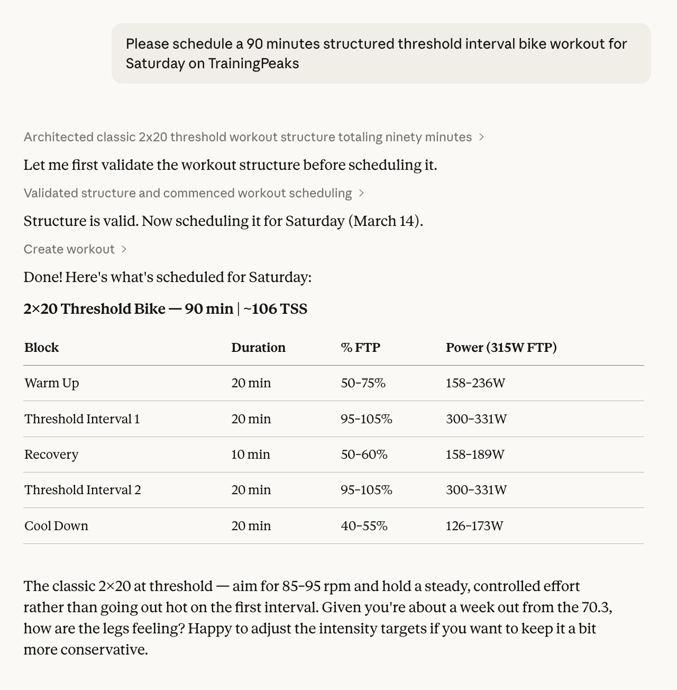
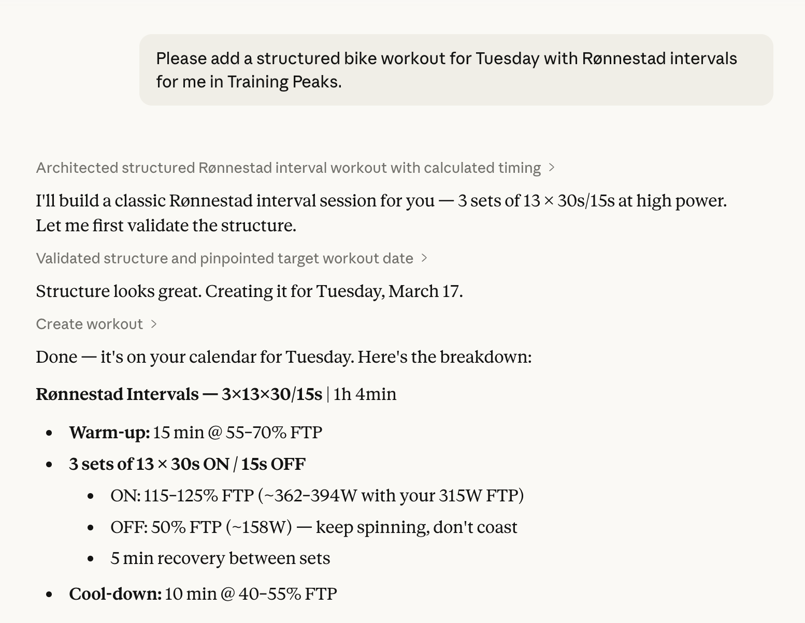
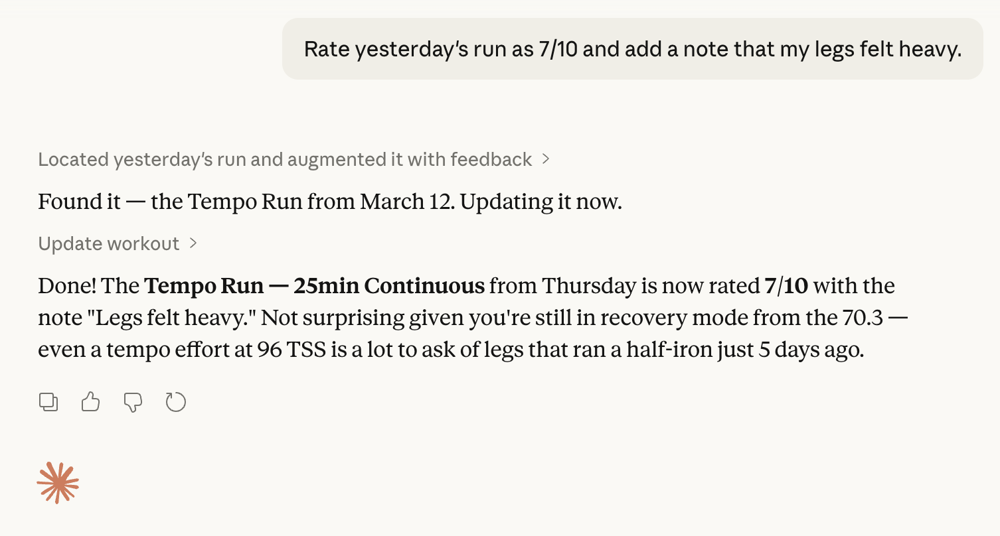
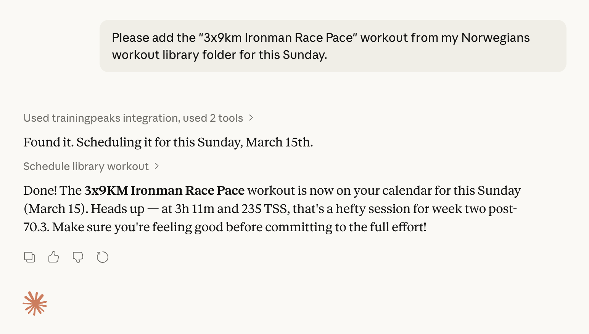

# TrainingPeaks MCP Server

An [MCP (Model Context Protocol)](https://modelcontextprotocol.io) server that connects Claude (or any MCP-compatible AI) to your TrainingPeaks account. Ask your AI to analyse your training load, create structured workouts, manage your training zones, review upcoming races, organise your workout library — all in plain English.

## Disclaimer

This project uses TrainingPeaks' unofficial internal web APIs — the same APIs the TrainingPeaks web application calls in the browser. It is not affiliated with, endorsed by, or supported by TrainingPeaks. Use it responsibly and in accordance with TrainingPeaks' terms of service. The APIs may change without notice.

## What you can do

**Read your training data**

- List workouts across any date range
- Get a full weekly summary including CTL, ATL and TSB (fitness / fatigue / form)
- Inspect individual workouts including their full interval structure
- Check your power and speed personal records
- View your training zones and thresholds (power/FTP, heart rate, running and swim pace)
- Browse upcoming races and goals

**Plan and manage workouts**

- Create planned cardio workouts with complete interval structures (warm-up, intervals, cool-down, multiple sets with recovery)
- Create structured strength / weight-training workouts with per-exercise, per-set reps and weights
- Update any field on an existing workout — title, description, date, duration, TSS, athlete notes
- Rate and comment on completed sessions
- Delete workouts

**Manage training zones**

- Update your FTP (power zones recalculated automatically using the Coggan 5-zone model)
- Update heart-rate zones (threshold HR, max HR, resting HR)
- Update run and swim pace zones
- Update nutrition targets (planned daily calories)
- Manage equipment (bikes and shoes) — retire items, set default, update names

**Exercise library**

- Browse your cardio workout template libraries
- Save workouts to a library for reuse
- Schedule library templates onto the calendar
- Create and delete library folders

## Authentication

TrainingPeaks does not offer a public API for personal use — the official Partner API is restricted to commercial partners. This server uses the same internal web API that the TrainingPeaks web app itself uses, authenticated via a browser session cookie.

### Getting your session cookie

1. Log in to [TrainingPeaks](https://www.trainingpeaks.com) in Chrome, Firefox, or Safari
2. Open DevTools (`F12` / `Cmd+Option+I`)
3. Go to **Application → Cookies → `tpapi.trainingpeaks.com`** (Chrome/Edge) or **Storage → Cookies** (Firefox/Safari)
4. Find the cookie named **`Production_tpAuth`** and copy its value

> **Note:** The session cookie is tied to your browser login. It will expire when you log out or after an extended period of inactivity. You will need to refresh it when that happens.

The server exchanges this cookie for a short-lived Bearer token automatically and refreshes it before it expires — you only need to provide the cookie.

## Requirements

- [Node.js](https://nodejs.org) 20 or later
- A TrainingPeaks account

## Installation

```bash
git clone https://github.com/nagelflorian/trainingpeaks-mcp-server.git
cd trainingpeaks-mcp-server
npm install
npm run build
```

## Claude Desktop setup

Add the following to your `claude_desktop_config.json` (find it at `~/Library/Application Support/Claude/claude_desktop_config.json` on macOS):

```json
{
  "mcpServers": {
    "trainingpeaks": {
      "command": "node",
      "args": ["/absolute/path/to/trainingpeaks-mcp-server/dist/index.js"],
      "env": {
        "TP_AUTH_COOKIE": "<paste your Production_tpAuth cookie value here>"
      }
    }
  }
}
```

Restart Claude Desktop after saving. You should see "trainingpeaks" appear in the tools panel.

## Example prompts

```
What workouts did I do this week and how is my fitness trending?

Show me my CTL, ATL and TSB for the last 3 months.

Create a 90-minute threshold bike workout for next Tuesday:
20 min warm-up, 3×15 min at 95–105% FTP with 5 min recovery, 10 min cool-down.

Rate yesterday's run as 7/10 and add a note that my legs felt heavy.

What are my best 20-minute power numbers from the last 6 months?

Move Thursday's long ride to Saturday and add "Zwift — Alpe du Zwift" to the title.

What is my current FTP? Update it to 385 watts.

When is my next A-race and what's my CTL target?

Create a strength workout for tomorrow: 3 sets of 15 reps of exercise 5178, then 3 sets of 8 reps per side of exercise 400 at 20 kg.

Show me my bikes and how many kilometres are on each.
```









## Available tools

### Training data

| Tool                  | Description                                                                      |
| --------------------- | -------------------------------------------------------------------------------- |
| `get_athlete_profile` | Name, athlete ID, and premium status                                             |
| `get_workouts`        | List workouts in a date range (max 90 days)                                      |
| `get_workout`         | Full details of one workout, including interval structure                        |
| `get_workout_types`   | All available sport types and sub-types with their IDs                           |
| `get_weekly_summary`  | Workouts + CTL/ATL/TSB for a given week                                          |
| `get_fitness_metrics` | Daily CTL / ATL / TSB across a date range                                        |
| `get_atp`             | Annual Training Plan — weekly TSS targets, training periods, and scheduled races |
| `get_workout_prs`     | Personal records set during a specific workout                                   |
| `get_peaks`           | All-time or period bests for cycling power or running pace                       |

### Athlete settings & equipment

| Tool                       | Description                                                               |
| -------------------------- | ------------------------------------------------------------------------- |
| `get_athlete_settings`     | Training zones (power, HR, pace), FTP, thresholds, nutrition target       |
| `update_ftp`               | Update FTP — power zones recalculated automatically (Coggan 5-zone model) |
| `update_hr_zones`          | Update threshold HR, max HR, or resting HR (zones scale proportionally)   |
| `update_speed_zones`       | Update run threshold pace (M:SS/km) or swim threshold pace (M:SS/100m)    |
| `update_nutrition`         | Update planned daily calorie intake                                       |
| `get_pool_length_settings` | Available pool lengths and the default for swim workouts                  |
| `get_weather_settings`     | Weather display location and enabled status                               |
| `get_equipment`            | List bikes and shoes with distance tracking and retirement status         |
| `create_equipment`         | Add a new bike or shoe                                                    |
| `update_equipment_item`    | Rename, retire, or update an equipment item (bike or shoe)                |
| `delete_equipment`         | Permanently delete a bike or shoe                                         |

### Health metrics

| Tool            | Description                                                                |
| --------------- | -------------------------------------------------------------------------- |
| `get_metrics`   | Retrieve logged health metrics (weight, HR, HRV, sleep, SPO2, steps, etc.) |
| `log_metrics`   | Log daily health metrics (weight, pulse, HRV, sleep, SPO2, steps, etc.)    |
| `get_nutrition` | Retrieve nutrition logs from connected apps (e.g. MyFitnessPal)            |

### Events & calendar

| Tool                     | Description                                           |
| ------------------------ | ----------------------------------------------------- |
| `get_focus_event`        | Your current focus / A-race with goals and CTL target |
| `get_next_planned_event` | The nearest upcoming event regardless of priority     |
| `get_events`             | All calendar events across a date range               |
| `create_event`           | Add a race or event to the calendar                   |
| `update_event`           | Update a race or event (name, date, priority, etc.)   |
| `delete_event`           | Delete a race or event                                |
| `create_note`            | Add a text note to the calendar                       |
| `get_note`               | Get details of a calendar note                        |
| `update_note`            | Update a calendar note's title, description, or date  |
| `delete_note`            | Delete a calendar note                                |
| `get_note_comments`      | List comments on a calendar note                      |
| `add_note_comment`       | Add or update a comment on a calendar note            |
| `get_availability`       | List unavailable/limited periods in a date range      |
| `create_availability`    | Mark dates as unavailable or limited availability     |
| `update_availability`    | Update an availability entry                          |
| `delete_availability`    | Delete an availability entry                          |
| `create_goal_list`       | Add a goal list to the calendar                       |
| `delete_goal_list`       | Delete a goal list                                    |

### Workout library

| Tool                       | Description                                        |
| -------------------------- | -------------------------------------------------- |
| `get_libraries`            | List all workout template libraries                |
| `get_library_items`        | List templates in a library                        |
| `get_library_item`         | Get full details of a template including structure |
| `create_library`           | Create a new library folder                        |
| `update_library`           | Rename a library folder                            |
| `create_library_item`      | Save a workout template to a library               |
| `update_library_item`      | Edit a library template (name, structure, etc.)    |
| `move_library_item`        | Move a template between library folders            |
| `delete_library_item`      | Delete a template from a library                   |
| `schedule_library_workout` | Schedule a library template onto the calendar      |
| `delete_library`           | Delete a library folder and all its templates      |

### Cardio workouts

| Tool                          | Description                                                      |
| ----------------------------- | ---------------------------------------------------------------- |
| `create_workout`              | Create a planned workout with optional interval structure        |
| `update_workout`              | Update title, notes, date, duration, TSS, athlete/coach comments |
| `delete_workout`              | Delete a workout                                                 |
| `copy_workout`                | Copy a workout to a new date                                     |
| `reorder_workouts`            | Reorder workouts within a day                                    |
| `get_workout_comments`        | Get the comment thread on a workout                              |
| `add_workout_comment`         | Add a comment to a workout's thread                              |
| `delete_workout_comment`      | Delete a comment from a workout's thread                         |
| `update_private_workout_note` | Set or update the athlete-only private note on a workout         |
| `validate_workout_structure`  | Validate an interval structure without creating a workout        |

### Strength workouts

| Tool                           | Description                                                            |
| ------------------------------ | ---------------------------------------------------------------------- |
| `create_strength_workout`      | Create a structured strength / weight-training workout on the calendar |
| `get_strength_workout_summary` | Get exercise list, sets, and compliance for a strength workout         |

## Creating structured cardio workouts

The `create_workout` tool accepts a `structure` parameter — a JSON string describing the interval layout. The server converts it to the TrainingPeaks wire format automatically (computing block offsets, intensity normalization for the visual polyline, etc.).

### Structure format

```json
{
  "primaryIntensityMetric": "percentOfFtp",
  "steps": [...]
}
```

`primaryIntensityMetric` options:

- `"percentOfFtp"` — cycling, targets are % of FTP (default)
- `"percentOfThresholdHr"` — heart-rate based, % of threshold HR
- `"percentOfThresholdPace"` — running, % of threshold pace

### Step types

**Single interval** (`type: "step"`):

```json
{
  "name": "Warm Up",
  "type": "step",
  "duration_seconds": 1200,
  "intensity_min": 40,
  "intensity_max": 50,
  "intensityClass": "warmUp"
}
```

**Repeated block** (`type: "repetition"`):

```json
{
  "name": "Intervals",
  "type": "repetition",
  "reps": 4,
  "steps": [
    {
      "name": "Hard",
      "duration_seconds": 360,
      "intensity_min": 85,
      "intensity_max": 95,
      "intensityClass": "active"
    },
    {
      "name": "Easy",
      "duration_seconds": 180,
      "intensity_min": 50,
      "intensity_max": 60,
      "intensityClass": "rest"
    }
  ]
}
```

Inner steps of a repetition block do not need `type`, `begin`, or `end` — those are added automatically.

**Multiple sets with recovery between them**: use separate repetition blocks at the top level with a `step` block in between:

```json
{ "name": "Set 1", "type": "repetition", "reps": 5, "steps": [ ... ] },
{ "name": "Recovery", "type": "step", "duration_seconds": 300, "intensity_min": 40, "intensity_max": 55, "intensityClass": "rest" },
{ "name": "Set 2", "type": "repetition", "reps": 5, "steps": [ ... ] }
```

### `intensityClass` values

| Value      | Use for                                                             |
| ---------- | ------------------------------------------------------------------- |
| `warmUp`   | Warm-up steps                                                       |
| `active`   | Work intervals                                                      |
| `rest`     | All recovery — within a repetition block or standalone between sets |
| `coolDown` | Cool-down steps                                                     |
| `other`    | Anything else                                                       |

> **Note:** Use `rest` for all recovery intervals. The TrainingPeaks API does not accept `recovery` as an intensityClass — the server automatically maps it to `rest` if provided.

### Optional cadence targets

Add `cadence_min` and `cadence_max` (rpm) to any step:

```json
{
  "name": "Tempo",
  "type": "step",
  "duration_seconds": 1800,
  "intensity_min": 76,
  "intensity_max": 90,
  "intensityClass": "active",
  "cadence_min": 88,
  "cadence_max": 95
}
```

### Full example — 4×6 min at threshold

```json
{
  "primaryIntensityMetric": "percentOfFtp",
  "steps": [
    {
      "name": "Warm Up",
      "type": "step",
      "duration_seconds": 1200,
      "intensity_min": 40,
      "intensity_max": 55,
      "intensityClass": "warmUp"
    },
    {
      "name": "Intervals",
      "type": "repetition",
      "reps": 4,
      "steps": [
        {
          "name": "Threshold",
          "duration_seconds": 360,
          "intensity_min": 95,
          "intensity_max": 105,
          "intensityClass": "active"
        },
        {
          "name": "Recovery",
          "duration_seconds": 180,
          "intensity_min": 45,
          "intensity_max": 55,
          "intensityClass": "rest"
        }
      ]
    },
    {
      "name": "Cool Down",
      "type": "step",
      "duration_seconds": 600,
      "intensity_min": 40,
      "intensity_max": 55,
      "intensityClass": "coolDown"
    }
  ]
}
```

## Creating structured strength workouts

The `create_strength_workout` tool creates a strength workout on the TrainingPeaks calendar using the separate strength platform (`api.peakswaresb.com`). The same Bearer token is used — no extra authentication is needed.

Each exercise is specified with:

- **`id`** — TrainingPeaks library exercise ID (numeric string, e.g. `"5178"`)
- **`name`** — Display name shown in the workout
- **`sets_data`** — Array of objects, one per set, with parameter name → value pairs

### Known parameter names

| Parameter         | Type    | Example          |
| ----------------- | ------- | ---------------- |
| `Reps`            | Integer | `"10"`           |
| `RepsPerSide`     | Integer | `"8"`            |
| `WeightKg`        | Decimal | `"20"`           |
| `WeightLb`        | Decimal | `"45"`           |
| `WeightPerSideKg` | Decimal | `"15"`           |
| `WeightPerSideLb` | Decimal | `"30"`           |
| `Duration`        | Integer | `"30"` (seconds) |

### Example — two exercises, progressive loading

```json
{
  "date": "2026-03-10",
  "title": "Upper Body Strength",
  "exercises": [
    {
      "id": "5178",
      "name": "90-90 Hip Stretch",
      "sets_data": [{ "Reps": "15" }, { "Reps": "15" }, { "Reps": "15" }]
    },
    {
      "id": "400",
      "name": "Alternating DB Press",
      "sets_data": [
        { "RepsPerSide": "8", "WeightPerSideKg": "15" },
        { "RepsPerSide": "8", "WeightPerSideKg": "20" },
        { "RepsPerSide": "8", "WeightPerSideKg": "25" }
      ]
    }
  ]
}
```

> **Note on exercise IDs:** Exercise IDs must be valid TrainingPeaks library IDs. These are not currently discoverable through a search tool — you will need to provide them from prior knowledge or look them up in the TrainingPeaks web app's network traffic.

## Development

```bash
npm run build   # clean dist/ and compile TypeScript
npm test        # build + run unit tests
npm run watch   # recompile on save
npm run format  # auto-format with Prettier
```

## Contributing

Bug reports and pull requests are welcome. When reporting issues, please include the error message returned by the tool (error responses include the full API response body to aid debugging).
